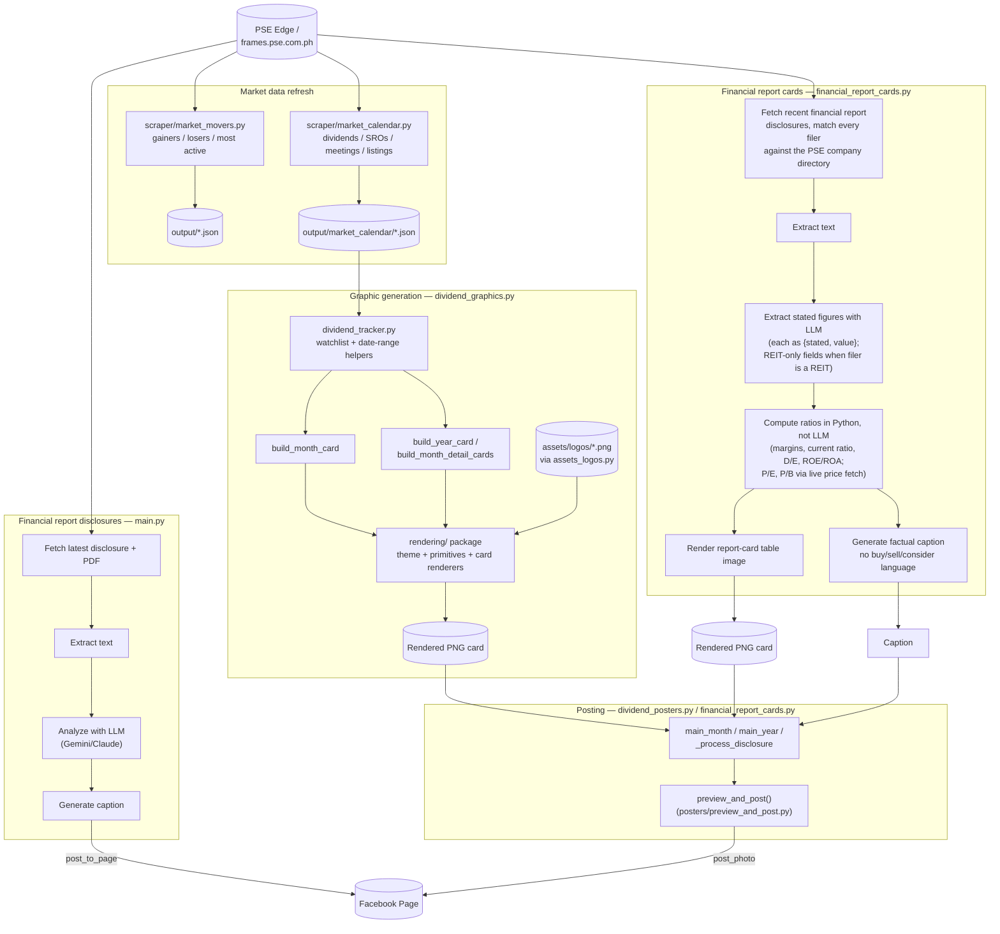

# AI Financial SNS Page

Automates a Facebook Page covering the Philippine Stock Exchange (PSE): scrapes
disclosures and market data from PSE Edge, analyzes them with an LLM
(Gemini/Claude), renders graphics, and posts to Facebook.

## Modules

- **Financial report disclosures** ([main.py](main.py)) — scrapes the latest PSE
  Edge financial report disclosure, extracts and analyzes the filing with an
  LLM, generates a caption, and posts it to Facebook.
- **Market movers** ([scraper/market_movers.py](scraper/market_movers.py)) —
  computes end-of-day gainers/losers/most active and caches them to `output/`.
- **Market calendar** ([scraper/market_calendar.py](scraper/market_calendar.py)) —
  refreshes dividends/SROs/meetings/listings for the current month.
- **Dividend graphics** ([dividend_graphics.py](dividend_graphics.py)) —
  builds dividend graphics scoped to the PSEi + REIT watchlist: `month`
  builds next month's dividend ex-date calendar card, `year` builds a full
  Jan-Dec dividend payout overview plus per-month detail cards. No
  dependency on `posters.facebook` — cards can be rendered and previewed
  without a Facebook post ever being possible.
- **Dividend posters** ([dividend_posters.py](dividend_posters.py)) — CLI
  (`month`/`year`) that calls into `dividend_graphics.py` to build the card,
  then previews/confirms and posts it to Facebook. The only module with a
  `posters.facebook` dependency for this pipeline.
- **Financial report cards** ([financial_report_cards.py](financial_report_cards.py)) —
  whenever any PSE-listed company files a financial report disclosure,
  extracts whatever figures that filing actually states (revenue, net
  income, balance sheet, cash flow, and — for the 8 PSE REITs only —
  distributable income, leverage ratio, NAV per share, occupancy rate;
  see the Obsidian vault's Dividend Stock Selection Criteria for why
  REITs get different fields), computes a few simple ratios from those
  stated figures in Python (never via the LLM — margins, current ratio,
  D/E, ROE/ROA, asset turnover, and P/E/P/B using a live price fetch),
  renders a report-card graphic, and posts it. Triggered mechanically by
  "they filed" — every company gets a report card every time, regardless
  of whether the figures look strong or weak, so this never functions as
  a curated "top pick." Deliberately overlaps with `main.py`'s coverage
  (narrative vs. structured figures for the same filing) rather than
  replacing it.

Shared watchlist/date-range helpers live in [dividend_tracker.py](dividend_tracker.py).
The `preview_and_post` confirm/post/record flow shared by
[dividend_posters.py](dividend_posters.py) and
[financial_report_cards.py](financial_report_cards.py) lives in
[posters/preview_and_post.py](posters/preview_and_post.py).
Graphic cards (dividend calendars, year overview) are rendered to PNG via the
[rendering/](rendering/) package (Pillow, DejaVu Sans, deliberately simple
utility graphics rather than polished design) — `theme.py` holds the palette
and layout constants, `primitives.py` holds shared drawing helpers, and each
card type (table, calendar, dividend stamp, year overview, ticker grid) has
its own module. [assets_logos.py](assets_logos.py) downloads/caches company
logos used on those cards into `assets/logos/`.

## Pipeline



## Setup

```bash
cd /home/cjoyales/personal/ai_financial_sns_page
source .venv/bin/activate
pip install -r requirements.txt
cp .env.example .env
```

Fill in `.env`:

| Variable | Purpose |
|---|---|
| `LLM_PROVIDER_ORDER` | Comma-separated fallback order, e.g. `gemini,claude` |
| `ANTHROPIC_API_KEY` | Claude API key |
| `GEMINI_API_KEY` | Gemini API key |
| `FACEBOOK_PAGE_ID` | Target Facebook Page ID |
| `FACEBOOK_ACCESS_TOKEN` | Long-lived Page access token |
| `FACEBOOK_APP_ID` / `FACEBOOK_APP_SECRET` | Used only by `scripts/refresh_fb_token.py` |
| `POST_MODE` | `confirm` (preview + `y/N` prompt) or `auto` (post immediately) |

At least one LLM provider key is required for `main.py`. A Facebook Page ID
and access token are required for any script that posts.

## Running

```bash
python main.py                          # financial report disclosures
python -m scraper.market_movers          # market movers
python -m scraper.market_calendar        # market calendar data refresh
python dividend_posters.py month         # market calendar graphic
python dividend_posters.py year          # year overview graphic
python financial_report_cards.py         # financial report cards, all filers (mechanical, per filing)
```

With `POST_MODE=confirm` (default), each script prints a preview and asks
before posting to Facebook. Set `POST_MODE=auto` to post unattended (required
under cron, since there's no terminal to answer the prompt).

Output (downloaded PDFs, extracted text, analysis, rendered images, "posted"
markers to avoid duplicate posts) is written under `output/`, split by
category.

## Facebook access token

Page access tokens expire. To refresh:

```bash
.venv/bin/python scripts/refresh_fb_token.py
```

Generate a short-lived User Access Token via Graph API Explorer first, then
paste it in when prompted; the script exchanges it for a long-lived Page
token and writes it into `.env`.

## Scheduling

[scripts/crontab](scripts/crontab) is a **draft** schedule (not installed
automatically). It runs each script at the appropriate time around PSE
trading hours (9:30am-3:30pm, Asia/Manila) with `POST_MODE=auto` and
`flock` to prevent overlapping runs. Review it, then install with:

```bash
crontab scripts/crontab
```

Check what's currently installed with `crontab -l`.
