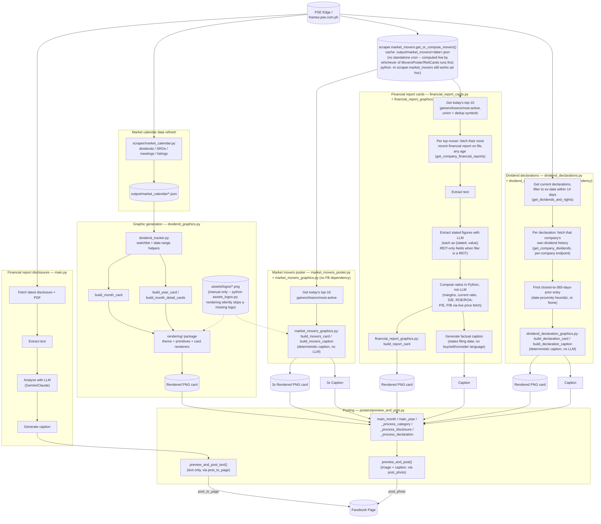

# AI Financial SNS Page

Automates a Facebook Page covering the Philippine Stock Exchange (PSE): scrapes
disclosures and market data from PSE Edge, analyzes them with an LLM
(Gemini/Claude), renders graphics, and posts to Facebook.

## Modules

- **Financial report disclosures** ([main.py](main.py)) — scrapes the latest PSE
  Edge financial report disclosure, extracts and analyzes the filing with an
  LLM, generates a caption, and posts it to Facebook as a text-only post via
  `posters.preview_and_post.preview_and_post_text()`.
- **Market movers** ([scraper/market_movers.py](scraper/market_movers.py)) —
  computes end-of-day gainers/losers/most active. No standalone cron entry
  — `market_movers_poster.py` and `financial_report_cards.py` both call
  its `get_or_compute_movers()`, which computes and caches the live
  snapshot itself on a cache miss, so a dedicated "just compute and cache"
  job would be redundant. Still runnable standalone
  (`python -m scraper.market_movers`) for an ad hoc refresh.
- **Market movers graphics** ([market_movers_graphics.py](market_movers_graphics.py)) —
  builds the Top 10 Gainers, Top 10 Losers, and Top 10 Most Active cards and
  their captions, market-wide. No dependency on `posters.facebook` — same
  "renderable/previewable without a Facebook post ever being possible"
  guarantee as `dividend_graphics.py`. Captions are deterministic string
  templates, not LLM-generated — this is just formatted facts, no analysis
  involved.
- **Market movers poster** ([market_movers_poster.py](market_movers_poster.py)) —
  calls into `market_movers_graphics.py` to build each of the 3 cards, then
  previews/confirms and posts each separately. Shares a same-day cached
  movers snapshot with `financial_report_cards.py` via
  `scraper.market_movers.get_or_compute_movers()` — whichever of the two
  scripts runs first for the day computes it live and caches it to
  `output/market_movers/`; the other reads that cache, so both reference
  the exact same top-10 lists without needing a particular run order, and
  the live scrape only happens once per day regardless of which script
  triggers it.
- **Market calendar** ([scraper/market_calendar.py](scraper/market_calendar.py)) —
  refreshes dividends/SROs/meetings/listings for the current month.
- **Dividend graphics** ([dividend_graphics.py](dividend_graphics.py)) —
  builds dividend graphics scoped to the PSEi + REIT watchlist: `month`
  builds next month's dividend ex-date calendar card, `year` builds a full
  Jan-Dec dividend payout overview plus per-month detail cards. No
  dependency on `posters.facebook` — cards can be rendered and previewed
  without a Facebook post ever being possible.
- **Dividend posters** ([dividend_posters.py](dividend_posters.py)) — CLI
  (`month`/`year`) that calls into `dividend_graphics.py` to build the card,
  then previews/confirms and posts it to Facebook. The only module with a
  `posters.facebook` dependency for this pipeline.
- **Dividend declaration graphics** ([dividend_declaration_graphics.py](dividend_declaration_graphics.py)) —
  builds a single-declaration card (rate, ex-dividend date, payment date,
  and growth vs. that company's own declaration from ~1 year prior, when
  one is found) and its deterministic caption. No dependency on
  `posters.facebook`, no LLM call. The growth comparison is a
  date-proximity heuristic (closest declaration to ~365 days before this
  one) — PSE Edge has no field labeling a declaration's period
  ("H1"/"Q2"/"Annual"), so the caption says "around this time last year,"
  never claiming a specific period it can't confirm; omitted entirely when
  no declaration falls within the tolerance window.
- **Dividend declarations** ([dividend_declarations.py](dividend_declarations.py)) —
  market-wide, for any dividend declaration whose ex-dividend date falls
  within the next 14 days (`EX_DATE_WINDOW_DAYS`): fetches that company's
  own recent dividend history via `scraper.pse_edge.get_company_dividends()`
  (a different, per-company-filtered endpoint from the market-wide
  `get_dividends_and_rights()` feed this project already used — confirmed
  live to genuinely filter by company, capped at roughly the last 3-4
  entries/~1 year), finds the closest-to-a-year-prior entry for the growth
  comparison, calls into `dividend_declaration_graphics.py` to build the
  card, then previews/confirms and posts it. Triggered mechanically by "a
  declaration's ex-date is coming up soon," market-wide, never selected by
  whether the rate looks good. The ex-date window exists because the
  underlying feed has no "announced" timestamp and returns every
  currently active declaration (live-tested at 543 entries spanning
  months into the future) — without it, first run would post hundreds of
  cards at once.
- **Financial report graphics** ([financial_report_graphics.py](financial_report_graphics.py)) —
  builds a single company's report-card image from its already-extracted/
  computed figures (`METRIC_ORDER` controls row priority so the most
  informative fields survive if the fixed-canvas table has to truncate). No
  dependency on `posters.facebook`, no LLM call — pure rendering.
- **Financial report cards** ([financial_report_cards.py](financial_report_cards.py)) —
  for every company in today's top 10 gainers/losers/most-active (same
  cached snapshot `market_movers_poster.py` uses, via
  `get_or_compute_movers()`), pulls that company's most recent financial report on
  file — regardless of how old it is — and extracts whatever figures the
  filing actually states (revenue, net income, balance sheet, cash flow,
  and — for the 8 PSE REITs only — distributable income, leverage ratio,
  NAV per share, occupancy rate; see the Obsidian vault's Dividend Stock
  Selection Criteria for why REITs get different fields). Computes a few
  simple ratios from those stated figures in Python (never via the LLM —
  margins, current ratio, D/E, ROE/ROA, asset turnover, and P/E/P/B using
  a live price fetch), calls into `financial_report_graphics.py` to build
  the card, then previews/confirms and posts it — the caption always
  states the filing's actual announce date, since a top mover's most
  recent report may be from an earlier quarter, not today. Triggered
  mechanically by "they're a top mover today" — a factual, rules-based
  criterion (rank by price/volume), the same category as the filing-based
  trigger this replaced, never selected by whether the figures look good.
  Runs after market close, since gainers/losers/most-active are end-of-day
  rankings. Deliberately overlaps with `main.py`'s coverage (narrative vs.
  structured figures, different trigger) rather than replacing it.

Shared watchlist/date-range helpers live in [dividend_tracker.py](dividend_tracker.py).
The preview/confirm/post/record flow shared across every poster lives in
[posters/preview_and_post.py](posters/preview_and_post.py):
`preview_and_post()` (image+caption, via `post_photo`) is used by
[dividend_posters.py](dividend_posters.py),
[market_movers_poster.py](market_movers_poster.py),
[financial_report_cards.py](financial_report_cards.py), and
[dividend_declarations.py](dividend_declarations.py);
`preview_and_post_text()` (text only, via `post_to_page`) is used by
[main.py](main.py).
Graphic cards (dividend calendars, year overview) are rendered to PNG via the
[rendering/](rendering/) package (deliberately simple utility graphics
rather than polished design) — each card type builds a Jinja2 context and
renders it through `rendering/templates/*.html` + `_shared.css` via headless
Chromium (`html_render.py`); `theme.py` holds the palette/layout constants
those templates mirror, and `primitives.py` holds the shared
logo-decoding/context-building helpers every renderer uses.
[assets_logos.py](assets_logos.py) downloads/caches company logos into
`assets/logos/` — **manual only**, not called by any pipeline script.
Rendering reads whatever's already cached and silently renders without a
logo for anything missing, so a cron run never triggers an unattended
download+decode of an externally-hosted image. Run
`python assets_logos.py SYM1 SYM2 ...` or `--all` to backfill the cache.
Both the download step (`assets_logos.py`) and the render step
(`rendering/primitives.py`'s `_open_image_no_bomb_warning()`) reject any
logo image over `MAX_LOGO_SOURCE_PIXELS` (4M pixels — generous for an icon,
well under Pillow's own 89M-pixel bomb-detection threshold) rather than decode it —
an oversized/corrupted download is deleted immediately instead of
lingering in the cache.

## Pipeline



## Setup

```bash
cd /home/cjoyales/personal/ai_financial_sns_page
source .venv/bin/activate
pip install -r requirements.txt
cp .env.example .env
```

Fill in `.env`:

| Variable | Purpose |
|---|---|
| `LLM_PROVIDER_ORDER` | Comma-separated fallback order, e.g. `gemini,claude` |
| `ANTHROPIC_API_KEY` | Claude API key |
| `GEMINI_API_KEY` | Gemini API key |
| `FACEBOOK_PAGE_ID` | Target Facebook Page ID |
| `FACEBOOK_ACCESS_TOKEN` | Long-lived Page access token |
| `FACEBOOK_APP_ID` / `FACEBOOK_APP_SECRET` | Used only by `scripts/refresh_fb_token.py` |
| `POST_MODE` | `confirm` (preview + `y/N` prompt) or `auto` (post immediately) |

At least one LLM provider key is required for `main.py`. A Facebook Page ID
and access token are required for any script that posts.

## Running

```bash
python main.py                          # financial report disclosures
python -m scraper.market_movers          # market movers (compute + cache only)
python market_movers_poster.py           # market movers, top 10 gainers/losers/most-active (posts)
python -m scraper.market_calendar        # market calendar data refresh
python dividend_posters.py month         # market calendar graphic
python dividend_posters.py year          # year overview graphic
python financial_report_cards.py         # report cards for today's top movers (run after market close)
python dividend_declarations.py          # dividend declaration cards, ex-date within 14 days
```

With `POST_MODE=confirm` (default), each script prints a preview and asks
before posting to Facebook. Set `POST_MODE=auto` to post unattended (required
under cron, since there's no terminal to answer the prompt).

Output (downloaded PDFs, extracted text, analysis, rendered images, "posted"
markers to avoid duplicate posts) is written under `output/`, split by
category.

## Facebook access token

Page access tokens expire. To refresh:

```bash
.venv/bin/python scripts/refresh_fb_token.py
```

Generate a short-lived User Access Token via Graph API Explorer first, then
paste it in when prompted; the script exchanges it for a long-lived Page
token and writes it into `.env`.

## Scheduling

[scripts/crontab](scripts/crontab) is a **draft** schedule (not installed
automatically). It runs each script at the appropriate time around PSE
trading hours (9:30am-3:30pm, Asia/Manila) with `POST_MODE=auto` and
`flock` to prevent overlapping runs. Review it, then install with:

```bash
crontab scripts/crontab
```

Check what's currently installed with `crontab -l`.
